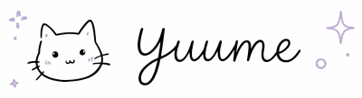
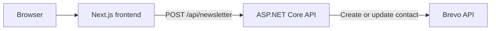

<div align="center">
  

  <p><strong>The world shaped by your thoughts.</strong></p>
  <p>
    A gentle digital space for journaling, meaningful connections,
    and shared dreamscapes.
  </p>

  <p>
    <a href="https://github.com/Nicole2137/Yuume/actions/workflows/frontend-ci.yml">
      
    </a>
    <a href="https://github.com/Nicole2137/Yuume/actions/workflows/backend-ci.yml">
      
    </a>
    
  </p>

  <p>
    <a href="#about">About</a> ·
    <a href="#features">Features</a> ·
    <a href="#tech-stack">Tech stack</a> ·
    <a href="#getting-started">Getting started</a> ·
    <a href="#testing">Testing</a>
  </p>
</div>


## About

Yuume is a calm online space built around the idea that words can bring people
closer. It is designed to let people capture thoughts, poems, and feelings,
discover kindred souls through what they write, and eventually shape shared
dream worlds together.

The project pairs a carefully crafted, responsive interface with a small
ASP.NET Core API. Its current implementation focuses on the visual foundation,
authentication views, responsive navigation, and newsletter subscriptions.

> [!NOTE]
> Yuume is in active development. The home and authentication experiences are
> implemented; journaling, dream matching, and shared spaces describe the
> product direction and are still on the roadmap.

## Features

### Available now

- Responsive landing page with an animated, atmospheric hero
- Dedicated login, registration, and password-reset views
- Desktop and mobile navigation
- Newsletter signup backed by the Brevo API
- Accessible form labels, keyboard-friendly controls, and responsive layouts
- Frontend unit tests plus backend unit and integration tests
- Separate GitHub Actions pipelines for the frontend and backend

### Product vision

- **Your Journal** — a private place for thoughts, poems, and feelings
- **Dream Matching** — connections shaped by the meaning behind your words
- **Shared Space** — a world that grows when two dreamscapes meet
- **Gallery, community, and shop** — new ways to explore and support Yuume

## Tech stack

| Area | Technologies |
| --- | --- |
| Frontend | Next.js 16, React 19, TypeScript 6, Sass Modules |
| UI | Motion, Lucide React, responsive custom components |
| Backend | ASP.NET Core 10, controller-based REST API, `HttpClient` |
| External service | Brevo Contacts API |
| Frontend tests | Vitest, Testing Library, jsdom |
| Backend tests | xUnit v3, ASP.NET Core integration testing, MockHttp |
| Automation | GitHub Actions, Dependabot |

## How it fits together



Next.js serves the interface and proxies `/api/*` requests to the backend.
The backend validates the request, keeps the Brevo API key server-side, and
translates external-service failures into appropriate HTTP responses.

## Project structure

```text
Yuume/
├── Frontend/                  # Next.js application and component tests
├── Backend/                   # ASP.NET Core API
├── Backend.UnitTests/         # Service and mapping tests
├── Backend.IntegrationTests/  # HTTP endpoint tests
├── .github/workflows/         # Frontend and backend CI
└── Yuume.slnx                 # .NET solution
```

## Getting started

### Prerequisites

- [Node.js 24](https://nodejs.org/)
- [pnpm 11](https://pnpm.io/)
- [.NET 10 SDK](https://dotnet.microsoft.com/download)
- A [Brevo](https://www.brevo.com/) API key for newsletter subscriptions

### 1. Clone the repository

```bash
git clone https://github.com/Nicole2137/Yuume.git
cd Yuume
```

### 2. Configure and run the backend

Store the API key with .NET user secrets so it never enters source control:

```bash
dotnet user-secrets set "Newsletter:ApiKey" "<your-brevo-api-key>" --project Backend
dotnet run --project Backend --launch-profile http
```

The API will be available at `http://localhost:8000`.

### 3. Configure and run the frontend

Create `Frontend/.env.local`:

```dotenv
BACKEND_API_URL=http://localhost:8000
```

Then install the dependencies and start the development server:

```bash
cd Frontend
pnpm install --frozen-lockfile
pnpm dev
```

Open [http://localhost:3000](http://localhost:3000) in your browser.

> [!IMPORTANT]
> Do not commit `.env.local`, Brevo credentials, or any other secrets.

## API

### Subscribe to the newsletter

```http
POST /api/newsletter
Content-Type: application/json

{
  "email": "dreamer@example.com"
}
```

The endpoint returns `200 OK` when the contact is created or updated. Invalid
requests and external-service failures are returned as `4xx` or `5xx`
responses.

## Testing

Run frontend quality checks from the repository root:

```bash
pnpm --dir Frontend lint
pnpm --dir Frontend test
pnpm --dir Frontend build
```

Run the complete backend test suite:

```bash
dotnet test Yuume.slnx
```

GitHub Actions runs the same frontend and backend checks for relevant pushes
and pull requests.

## Contributing

Yuume is still taking shape. If you would like to help:

1. Fork the repository and create a focused branch.
2. Keep changes consistent with the project's gentle visual language.
3. Add or update tests for changed behavior.
4. Run the relevant checks locally.
5. Open a pull request describing both the change and its motivation.

<div align="center">
  <br />
  
  <p><em>Soft thoughts, beautiful days.</em></p>
</div>
